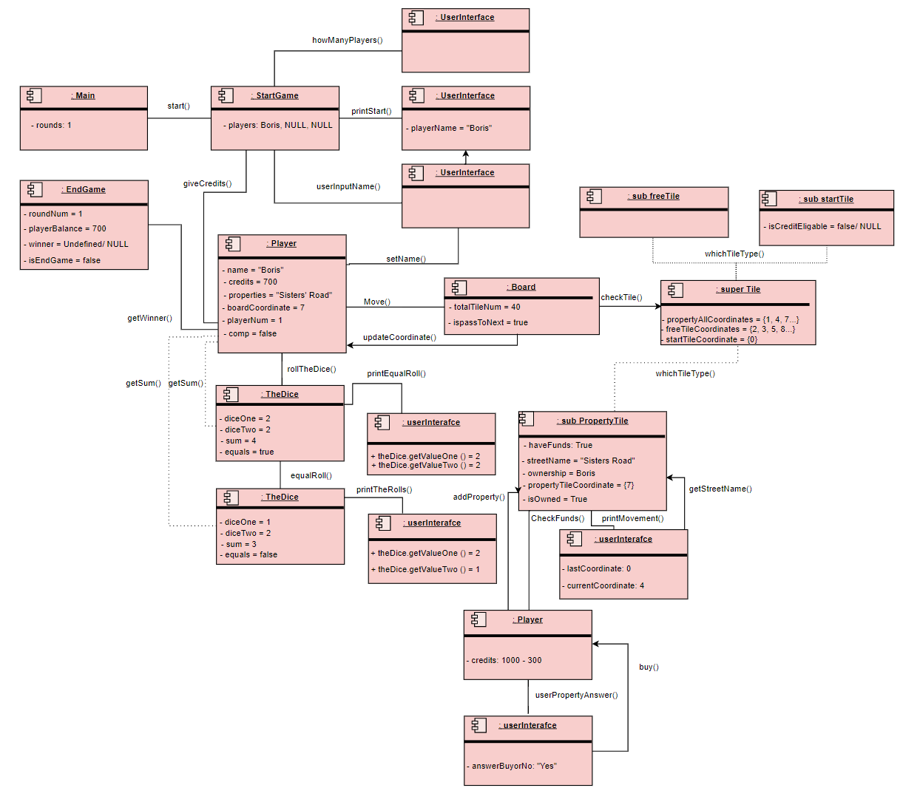

# The Indeded Desing
In my diagrams there was misunderstanding regarding the requirements of the diagrams, I did not followed the example given within the assignment, however I decided to take one scenario where I cover all possible outputs that will happen such as, 
free tile movement, property tile movement and start tile instance where user rolls equal dice value and gladly will explain 
everything step by step. The reason I decided to make it that way was to cover as much as I can for one diagram instance and 
show that I know what I am doing. Thanks for your attention and hope you will enjoy it (I did personally).

## Class diagram
Started class diagram with 10 classes. Beginning with the StartGame class which contains players within Arraylist and the only method the class have is "start()" which after the call it is automatically doing call the rest of the functions within itself. Player have multiple constructors and methods within since it is the our class that interacts with all the classes and it is the main focus for the general program flow.  The dice on the otherside is not taking big part, however it is still carrying crucial important within the program. Taking "getSum()" directly after the roll since it will be much easier to follow only one integer instead of following two integers all the time, there is a case when two rolls have the same value, that user should move first and then roll again if does not go to bankcrupcy, my designed implementation does support that and have boolen constructor "equal" which is followed by method "isEqual" which basically checks and acts regarding to that. Then when the dice roll is done it moves the Board where board is doing calculations that are necesarry if user is on property tile 
and checking wheter it should pass to the next player or the player will have another roll after he moves. Then passes with "checkTile()" method to the super class "Tile" which class contains all the coordinates of different tiles with one method "whichTileType" returning string value after checking the coordinates of all the tiles and comparing them with the coordinate that player is located within the board. In freeTile nothing happens, only passes to the next player or the next roll respectfully. if it is start Tile player is being rewarded with 200 credits and property tile which is the most fun part contains multiple constructors since it is essential part of the program as well. One thing about the Endgame class is that it does check round number after each time eight players end their turn (there will be adittional if statements for that instance where equal dice were rolled) to end the game after 10 rounds and adittionally checking player balance after each round as well to finish the game if one player does bankcrupcy, this could be implemented to the property tile as method as well, however it will be more realistic to check if someone is bankcrupting or not from the EndGame class (there are methods to check player fund when he is on property tile as well which will be described under the object diagram.) Dice and user interface are dependant from the Player since they won't be functionally by themselves.

## Object diagram
Starting with the object diagram where basically tried to describe one full turn and constructor values for each of the classes. Starting with main where "**start()** is being called and the game starts with the userInterface asking how many players are going to be playing and to arrange rest of the players as bots with maximum eight player objects for each game. The reason behind asking the number of players is because on the **PLayer** object there is a constructor "**comp**" which is boolean value and using two for loops will be able to create two type of players, in that case real world player and AI bots, main difference will be the property answer which will be random. The names for these players still will be given by real world players, however it is possible to include random names as well by gathering some names together within a list and taken randomly from that list. Even if the names happen to be same players will have **playerNum** which will basically used as primary key to uniquely identify the users in case of redundancy of the names, could have done that only with the index of the Arraylist that is located in the **StartGame** class, however decided to implement additional counters just to have more options and flexibility while encapsulating the objects. Then when the name comes as user input the startGame will be presetten to forward these names to **players[n].setName()** for each player and then the game starts after identifying all the players and giving each player one thousand credits (player num does help for checking who got credits and who not as well). Player on the first index (which in our case is called "Boris") is being printed by the userInterface that he is offered the dice and he will roll. After dice are being rolled which is random from 1-7 or from 1-6 + 1 either way works, Dice class does returns the **getSum()** and adittionally checks if dices where equal with a method that returns boolean value (**isEqualRoll**). In my case I decided to pick first dice values to be equal (2-2) to be able to show what will follow and that all functionality is tried to be implemented. Firstly **printCurrentLocation** is being called from the userInterface since it was required to print from where user starts his move and then current player does gets that sum and calls **move()** method, where we enter the **Board** and start the movement within the board. Board calls **checkTile()** redirecting to the Tile superclass player's coordinate after the roll and to which tile he/she lands to and does return basic string which will then be recursive operation within the Tile classs and give player options correspondingly with multiple if statements and what to follow afterwards. The first equal dice value in my case does drags the player instance to property tile. propertyTile's first thing to do is to check if the property **isOwned()** by someone by iterating over the player Arraylist and getting all names and cheking each name aditionally checking if the **Owned** variable is true or false, doing multiple checks over here since it is key point and in case of encounter of bug within one of the two methods the other method will also check and will still provide the correct information, which I believe is important for encapsulation and having a backup plan in case of errors with the healthy program flow through the whole process. Once this step is done directly checking player funds (**checkFunds()**) to be able to avoid asking if the user wants to buy property or not which will be nonsense if the player does not have funds, but the program still asks which will also cause the loop to break down. Then when the checkFunds() returns value true the rest of the process starts. In the beginning of the next round firstly userInterface will be trigerred to ask the player if he wants to buy or pass and with simple if statements the rest of the flow wll be ensured since it was equal dice value. In my case I did took the "Yes" as an answer since wanted to show more than what was given in the example on gitlab. When we get positive answer from the player automated process starts firstly taking off three hundred credits from the player, then adding the property name to the Arraylist of located in player instance (**addProperty()**) then setting the Ownership of the current instance of property to **Player[n].getName()** which will be checked by the **isOwned()** method and will give true response afterwards for the rest of the players, lowering their credit value. aditionally setting the **isOwned()** boolean to true for exactly the same reason as it was stated before, adittional layer in case of error within the program. When everything is set we finally update the Player coordinate to the coordinate that we were making operations before and printing regarding the tile type for each tile type different outputs apply. Then I hope you did not forgot the equal dice value. When **ispassToNext** returns false value the program firstly does the necesarry operations regarding the property tile and then rolls again. Did decided to make it like that since it was stated that the movement is the last thing player does before ending his turn so moved and checked the tile and did the operations that were necesarry and will be second turn same as how it is in the real world instead of moving two dice rounds at once and trying to check the tiles afterwards which was one of the key moments for me to overcome. In my case took the second roll as (1-2) checked with the player again and made him to land on a freeTile where nothing basically happens. . , had **ispassToNext()** method which will be false in case of equal dice roll and will be called after our first move is done. After second round starts and the property was purchased firstly userInterface does print that action and then printing the diceValues again moves the player withing the board, checking the tile once more and on freetile updates coordinate and since there were no equal dice values for the second roll **ispassToNext** automatically will be true. This method will be followed by updating the player coordinate and then printing the end of the turn with the userInterface. Lastly checking the round num and player funds with **EndGame** class to assure proper work of the program without erros even though I do check the player balance when player steps on propertyTile as well.

## Sequence diagram
Finally the sequence diagram which tells a lot about the whole process, but there is not much to comment about it, basically it does follow the order explained above.

